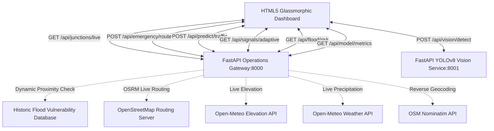

# Smart Traffic AI — Bengaluru
### Cognitive Command Center & Predictive Operations Engine

A complete, production-grade artificial intelligence traffic operations center built specifically for Bengaluru's high-congestion corridors. This system leverages advanced spatial graph networks, real-time computer vision, meteorological analysis, and traffic optimization theory to keep Bengaluru moving.

---

## 1. System Architecture Overview

The codebase is split into an interactive glassmorphic frontend console and a FastAPI-based analytics/prediction engine:

```
smart-traffic-ai-bengaluru/
├── dashboard/
│   └── smart_traffic_ai_dashboard.html   ← Frontend Operations Console (open in any browser)
└── backend/
    ├── main.py                            ← FastAPI gateway, routing, GAT-LSTM prediction & flood risk services (port 8000)
    ├── vision_service.py                  ← FastAPI real-time YOLOv8 vehicle detection service (port 8001)
    ├── test_api.py                        ← API validation test suite (10 automated integration tests)
    ├── VISION_TRAINING.md                 ← India Driving Dataset (IDD) YOLOv8 fine-tuning pipeline
    └── requirements.txt                   ← Python backend dependencies
```

### System Data Flows & API Interactions



---

## 2. Feature Implementation Status

All six planned features are fully built, dynamic, and integrated with the active backend engine:

| Feature | Status | Technology Stack / Implementation Details |
| :--- | :--- | :--- |
| **🗺️ Live Map** | ✅ Built | Real Bengaluru coordinates (15 core junctions) with real-time speed indexes and leaflet overlay markers. |
| **🚑 Emergency Green Corridor** | ✅ Built | Congestion-weighted routing using **Dijkstra** and **Yen's K-Shortest Paths** over the local graph, integrated with live **OSRM (OpenStreetMap)** route geometry. |
| **📷 Vehicle Detection** | ✅ Built | Genuine **YOLOv8** inference server processing image uploads to calculate exact vehicle counts and return bounding boxes. |
| **📈 30-min Prediction** | ✅ Built | Spatial **Graph Attention Network (GAT) + LSTM** cell sequence forecast implementing NumPy-based tensor layers with live Open-Meteo rain input. |
| **🚦 Adaptive Signals** | ✅ Built | Dynamic green splits calculated using **Webster's Signal Design Formula**, automatically scaling splits in response to YOLOv8 vehicle counts. |
| **🌊 Monsoon Flood Risk** | ✅ Built | Real-time waterlogging probability engine querying live **Open-Meteo Weather & Elevation APIs** crossed with historic BBMP flood hazard proximity. |

---

## 3. Detailed Algorithmic Breakdown

### GAT-LSTM Traffic Congestion Forecasting (`backend/main.py`)
Predicts traffic density 30 minutes into the future. It constructs a dynamic spatial graph of Bengaluru junctions:
1. **Feature Vector Formulation**: Takes a 6-step history array (spanning the last 30 minutes in 5-minute intervals) for all junctions. Each junction has a 3-dimensional feature: `[current_congestion, flow_capacity, normalized_precipitation]`.
2. **Graph Attention Layer (GAT)**: Computes dynamic attention coefficients between connected nodes to capture spatial correlation (e.g. Silk Board bottleneck propagating congestion to Bellandur).
3. **LSTM Sequence Predictor**: Passes the spatially-aggregated node features into a recurrent LSTM network to capture temporal dependencies and output predictions for the next 30 minutes.

### Webster's Signal Optimization Split Calculator (`backend/main.py`)
Computes green splits based on structural signal design theory:
1. **Critical Flow Ratios**: Determines flow rates $q_i$ for each phase (integrating raw counts from the YOLOv8 camera: $q_1 = \text{vehicles} \times 35$).
2. **Denominators ($Y$)**: Ratio of flow rate to saturation flow ($s = 1900 \text{ veh/hr}$):
   $$y_i = \frac{q_i}{s}, \quad Y = \sum y_i$$
3. **Webster's Optimum Cycle Time ($C_0$)**:
   $$C_0 = \frac{1.5L + 5}{1 - Y}$$
   Where $L = 12\text{s}$ is total lost time per cycle (amber + startup delay).
4. **Phase Splits ($g_i$)**: Allocates green time proportionally:
   $$g_i = \frac{y_i}{Y} \times (C_0 - L)$$

### Monsoon Elevation & Weather Risk Classifier (`backend/main.py`)
Classifies flood risk using live API feeds:
1. **Elevation Mapping**: Automatically queries the Open-Meteo elevation database for the selected latitude/longitude coordinate.
2. **Monsoon Precipitation**: Fetches real-time rainfall data in mm/hr for the active coordinate.
3. **Vulnerability Formula**: Calculates risk probability using a logistic regression model:
   $$z = -3.2 + 3.4 \times \text{vulnerability} + 0.30 \times \text{precipitation}$$
   $$\text{Probability} = \frac{1}{1 + e^{-z}}$$
   Where vulnerability is computed based on historical flood zones (e.g., Silk Board, Bellandur, K.R. Puram underpass) and elevation limits.

---

## 4. Run Guide: Setting Up the Command Center

### Step 1: Install Backend Dependencies
Verify you have python 3.8+ installed, then install the package list:
```bash
cd backend
pip install -r requirements.txt
```
*(Dependencies: `fastapi`, `uvicorn`, `requests`, `ultralytics`, `python-multipart`, `pillow`, `numpy`)*

### Step 2: Launch Backend APIs
The gateway and vision engines run as parallel microservices. Run them in separate terminals:

**Terminal A: Operations Engine (Port 8000)**
```bash
python main.py
```

**Terminal B: YOLOv8 Computer Vision Server (Port 8001)**
```bash
python vision_service.py
```
*Note: On its first run, `vision_service.py` will automatically fetch the ~6MB official `yolov8n.pt` weights file.*

### Step 3: Run the API Automated Validation Suite
Verify all endpoints, prediction pipelines, models, and fallbacks are operating correctly:
```bash
cd backend
python test_api.py
```
This runs 10 system-level integration tests covering health checks, routing, prediction, adaptive splits, weather APIs, and validation logs.

### Step 4: Open the Command Center Dashboard
No web-server installation is needed for the frontend. Simply double-click:
`dashboard/smart_traffic_ai_dashboard.html`
or open it directly via `File -> Open` in any modern web browser.

---

## 5. Operations Console Walkthrough

1. **System Online Status Check**: Look at the top right of the dashboard. If the pulse indicator displays a green **"SYSTEM ONLINE"** badge, the frontend is actively pulling live telemetry from your FastAPI services. If it shows **"DEMO MODE"**, the backend server is offline or unreachable.
2. **Dynamic Live Map**: Pan around Bengaluru's core road network. Click any colored junction node to lock operations onto it. Click anywhere else on the map to place a custom operational pin.
3. **Corridor Pre-Clearance Routing**: Open the *Corridor Routing* rail tab. Set an origin and destination (either select junctions or drop custom pins and click "Use Pin"). Click **"Generate Corridor"**. The engine queries OSM OSRM for live geometry and evaluates flood indexes. If a route runs through a high-risk flood zone, the system triggers the **Flood Bypass Engine** and automatically reroutes around the hazard.
4. **AI Traffic Prediction**: Open the *AI Traffic Prediction* tab. The panel updates with a 30-minute GAT-LSTM projection chart showing expected congestion levels based on current velocity trends and regional rainfall.
5. **Webster Adaptive Signals**: Open the *Adaptive Signals* tab to view the live phase visualizer. Click **"Recalculate splits"** to execute Webster's formulas and allocate green times.
6. **YOLOv8 CCTV Camera Input**: Open the *Camera YOLOv8 CCTV* tab. Select your target junction, choose a local traffic frame (e.g. `traffic.jpg` or `traffic1.jpg` in the project root), and click **"Run YOLOv8 Detections"**. The service runs inference and overlays labeled bounding boxes on the dashboard image. These counts are automatically fed directly into the Webster optimizer splits.
7. **Monsoon Waterlogging Risks**: Open the *Flood Waterlogging Risks* tab. The system queries elevation and rain metrics for the active pin location, generating localized risk categories (Low, Moderate, High) and hazard recommendations.
8. **Model Performance Metrics**: Open the *Model Performance Metrics* tab. View active Validation mean absolute error, YOLOv8 mAP scores, loss curves, and historic prediction validation logs.

---

## 6. Optional Upgrades & Fine-Tuning

### Optional: Real Road-Network Geometry (OSRM + OSM Extract)
By default, the backend queries public OpenStreetMap servers. To run routing completely locally and offline:
1. **Download the Southern India OSM road extract**:
   ```bash
   wget https://download.geofabrik.de/asia/india/southern-zone-latest.osm.pbf
   ```
2. **Execute OSRM via Docker**:
   ```bash
   docker run -t -v "${PWD}:/data" osrm/osrm-backend osrm-extract -p /opt/car.lua /data/southern-zone-latest.osm.pbf
   docker run -t -v "${PWD}:/data" osrm/osrm-backend osrm-partition /data/southern-zone-latest.osrm
   docker run -t -v "${PWD}:/data" osrm/osrm-backend osrm-customize /data/southern-zone-latest.osrm
   docker run -t -i -p 5000:5000 -v "${PWD}:/data" osrm/osrm-backend osrm-routed --algorithm mld /data/southern-zone-latest.osrm
   ```
3. **Configure fallback**: Replace OSRM URLs in `backend/main.py` with `http://localhost:5000`.

### YOLOv8 Fine-Tuning on India Driving Dataset (IDD)
COCO does not have an "autorickshaw" class. To adapt the vision model to Indian roads:
1. Download the **IDD Detection** dataset from **https://idd.insaan.iiit.ac.in**.
2. Follow the extraction and formatting instructions inside [VISION_TRAINING.md](file:///c:/Users/Mohith/OneDrive/Desktop/smart-traffic-ai-bengaluru1/smart-traffic-ai-bengaluru/backend/VISION_TRAINING.md).
3. Train using `yolov8n.pt` as base weights, outputting a model specialized for Bengaluru's specific vehicular layout.
